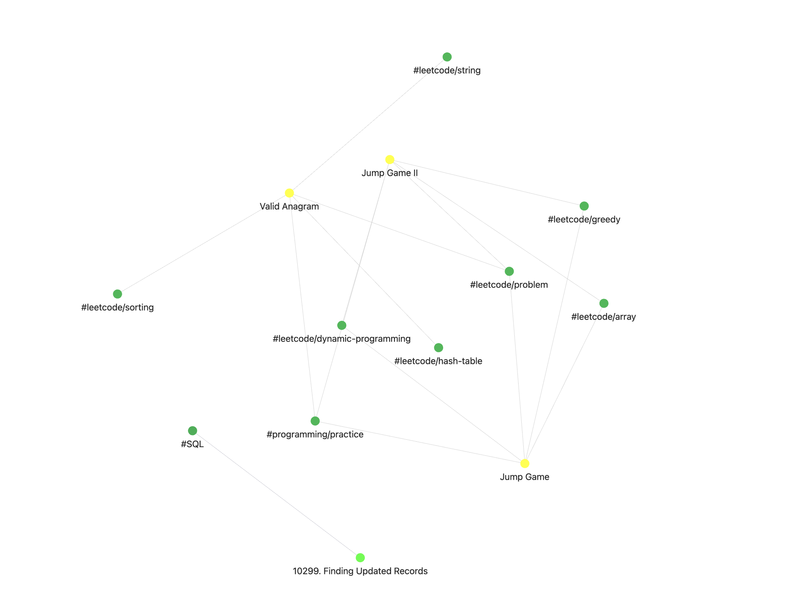

# 2026 Daily Coding Challenge

Personal Obsidian vault for tracking coding problem solutions and algorithm study. Automatically backed up from my local environment.

## Obsidian Knowledge Graph
<p align="center">
  
</p>

<p align="center">
  
</p>
## Status
- In progress. 

##  Purpose
- Practice **LeetCode** (Mainly Algorithms & some SQL) and **StrataScratch** (Advanced SQL) every day.
- Build a linked knowledge base for technical interviews using Obsidian.

##  Features
- **Auto-Sync**: Automatically backed up to GitHub **every 30 minutes**.
- **Smart Templates**: Standardized notes with complexity analysis and logic breakdowns.
- **Data-Driven**: Dashboard views via Dataview plugin.

## Used Plugins 
- **Dataview**: Automatically generates table-based dashboards for problem tracking.  
- **QuickAdd**: Uses custom scripts to fetch metadata and create notes from URLs.  
- **Obsidian Git**: Manages automated version control and 30-minute backup intervals.

##  Structure
```text
.
├── LeetCode-Solutions/      # LeetCode problem notes
├── StrataScratch-Solutions/ # StrataScratch problem notes
├── Templates/               # Standardized markdown templates
├── scripts/                 # QuickAdd JavaScripts
├── LeetCode-Dashboard.md # Dataview for LeetCode progress 
├── Strata-Dashboard.md # Dataview for StrataScratch progress
└── README.md                # this file